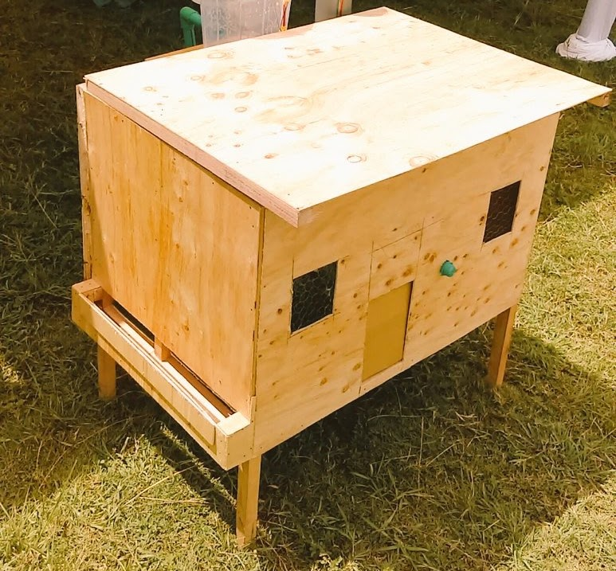
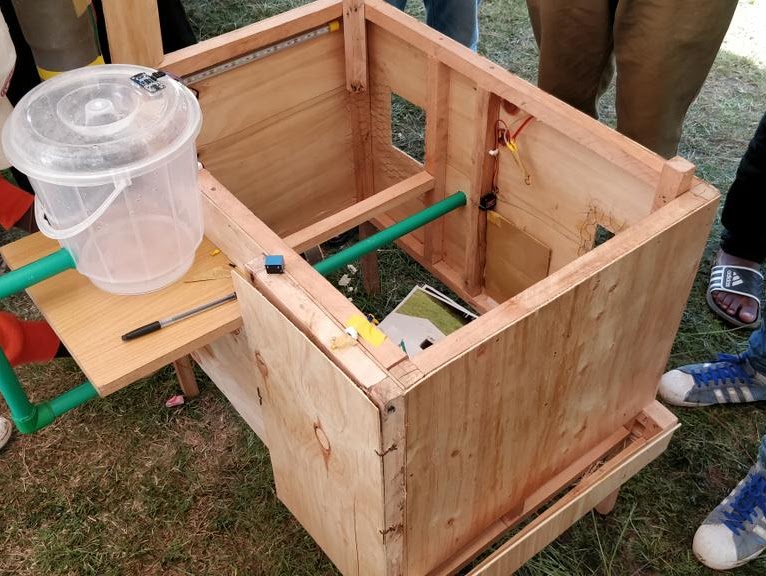
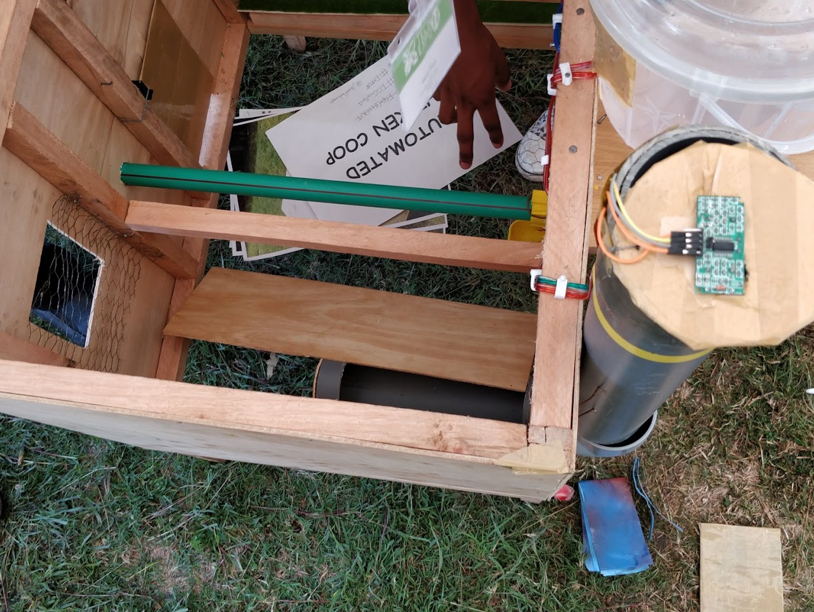

# 🥚 Eggcellent - Automated Smart Chicken Coop

A smart agricultural IoT coop environment controller featuring climate regulation, scheduled door actuators, and feeder monitoring.

## 📸 Project Gallery
| Completed Coop Exterior | Construction & Assembly | Internal Systems & Sensors |
| :---: | :---: | :---: |
|  |  |  |

## 📖 Overview
**Eggcellent** is an automated IoT poultry management system designed to optimize coop environment conditions. It automates daily coop care tasks including morning/evening door opening, temperature and humidity regulation, predator security locking, and automated feed/water level monitoring.

## 🛠️ Key Features
- **Automated Motorized Door Actuator:** Real-time clock (RTC) and light sensor (LDR) controlled door opening/closing.
- **Environmental Climate Regulation:** DHT11/DHT22 temperature & humidity monitoring with automated ventilation fan control.
- **Feeder & Water Level Sensing:** Ultrasonic / load sensors detect feed and water replenishment needs.
- **IoT Telemetry & Alerts:** Remote Wi-Fi status alerts sent to the owner's smartphone.

## 🔌 Hardware Architecture
- Microcontroller (ESP32 / Arduino Nano)
- Linear Actuator / Stepper Motor Driver (L298N / A4988)
- DHT22 Temperature & Humidity Sensor
- Real-Time Clock (DS3231 RTC) & LDR Light Sensor
- Ultrasonic Distance Sensor (HC-SR04)
